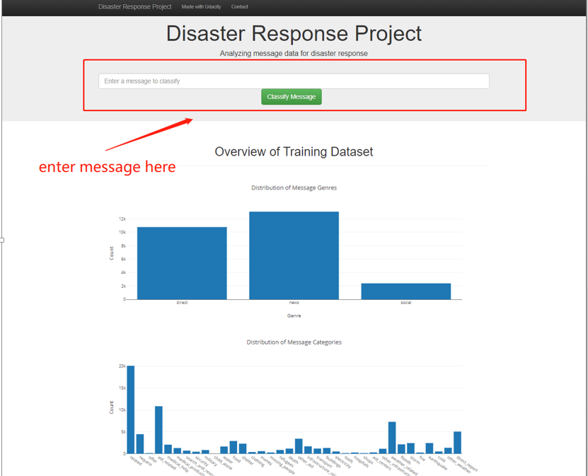
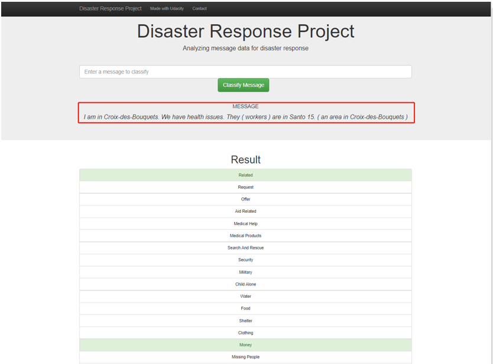

# Data Science Udacity - Disaster Response Pipeline
## Introduction
This project will show the predict of disaster category base on the your input text. 
## Contents
- project
- ETL and ML Pipeline notebook - contain two notebook with detailed approach for ETL and ML pipeline
- screen-shot - contain screen shots used in README.md
- README.md

## Project Summary
#### The goal for this project is to create a web app that have the ability to predict Disaster base on the input message.

The project divide in to 3 sections:
- 1. ETL -- Extract data frome message and catgory file then transform them into on message file, by the end we load the file with SQL database (Please see ETL and ML Pipeline notebook folder for more detail)
- 2. ML -- Extract data from SQL data base then use the data to build a machine learning classifcation model to predict disaster category (Please see ETL and ML Pipeline notebook folder for more detail)
- 3. deploy the cleaned data and model with web app

## libraries used
The library used projetc are: pandas, time , skearn, nltk, re, flask, joblib, etc

- pandas was use to clean and manage data
- time was use to calcuate amount of time use for the process to happen
- sklearn was use for modeling data and find key elements 
- nltk was use for tokenize text
- re was use for find the url within text
- flask was use for build a web app with python
- joblib was use for save and load model

### Instructions:
1. Run the following commands in the project's root directory to set up your database and model.

    - To run ETL pipeline that cleans data and stores in database
        `python project/wrangling_python/ETL.py`
    - To run ML pipeline that trains classifier and saves
        `python project/wrangling_python/ML.py`

2. Run the following command in the app's directory to run your web app.
    `python run.py`

3. Go to http://0.0.0.0:3000/
   Or Go to http://localhost:3000/

